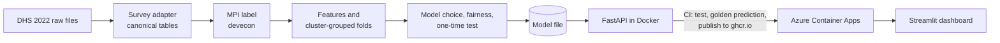

# Poverty targeting: predicting multidimensional poverty from a short questionnaire

[](https://github.com/Mbibachris/poverty-targeting/actions/workflows/ci.yml)

A proxy-means-test (PMT) system for Ghana: from 22 quick household questions, it estimates how
likely a household is to be **multidimensionally poor** under the global MPI (UNDP/OPHI),
explains why, and shows who a budget-limited programme would reach.

**Try it**
- **Dashboard** (no code needed): https://poverty-targeting-ghana.streamlit.app/
- **API docs**: https://poverty-targeting-api.mangograss-dd837579.spaincentral.azurecontainerapps.io/docs

Both scale to zero when idle, so the first request after a quiet period can take up to a minute.
This is a demonstration: please don't enter real households' personal information.

## Results at a glance

| | |
|---|---|
| Label | Global MPI built from Ghana DHS 2022 with [devecon](https://github.com/Mbibachris/devecon); published figure (H = 24.8%) falls inside our bounds (22.8%-25.9%) |
| Deployed model | LightGBM on 24 questionnaire features ("Tier B") |
| Test performance (households never seen) | ROC-AUC 0.892; at a 25% budget it reaches **72% of poor people**, vs 25% by random selection |
| Strict benchmark (no label inputs, "Tier A") | Logistic regression, ROC-AUC 0.826: the accuracy gap measures circularity |
| Known gaps | Poor urban and female-headed households are missed more often (see fairness report) |

## Why it is built this way

- **Validated label.** The MPI is reproduced from raw DHS files and checked against the official
  Ghana figure; data limitations (child mortality from recent births, adolescent nutrition) are
  bounded rather than hidden. See `reports/validation/`.
- **Circularity measured, not ignored.** Many PMT questions (electricity, cooking fuel) are also
  MPI ingredients. An automatic check keeps them out of the strict tier, and an audit measures
  every feature's association with every indicator. See `reports/audit/`.
- **Honest evaluation.** Folds grouped by survey cluster (no neighbour leakage), population
  weights throughout, one sealed test fold used once, and a rule for choosing models fixed
  before testing. See `reports/cv/`.
- **Fairness decided deployment.** The simpler model missed ~75% of poor childless and small
  households; the deployed model does not. See `reports/fairness/`.
- **Targeting in programme terms.** Exclusion and inclusion errors at a fixed budget, not just
  accuracy. See `reports/targeting/` and the [model card](models/GH2022DHS_tierB_lightgbm.model_card.md).

## Architecture



## Using the API

```bash
curl -X POST https://poverty-targeting-api.mangograss-dd837579.spaincentral.azurecontainerapps.io/predict \
  -H "Content-Type: application/json" -d @examples/predict_request.json
```

Returns the probability of being MPI-poor, whether the household would be selected at the
chosen budget, and the main reasons. Endpoints: `/health`, `/model/info`, `/predict`,
`/predict/batch`.

## Reproducing the results

DHS data cannot be redistributed. Register at dhsprogram.com, request Ghana 2022, and place the
files as described in `data/raw/README.md`. Then:

```bash
pip install -e ".[dev,train,api,dashboard]"
python -m poverty_targeting.build GH2022DHS      # canonical tables
python -m poverty_targeting.label GH2022DHS      # MPI label
python -m poverty_targeting.validate GH2022DHS   # vs the published figure
python -m poverty_targeting.dataset GH2022DHS    # features + folds
python -m poverty_targeting.audit GH2022DHS      # circularity audit
python -m poverty_targeting.compare GH2022DHS    # model comparison
python -m poverty_targeting.targeting GH2022DHS  # calibration + targeting curves
python -m poverty_targeting.fairness GH2022DHS   # subgroup errors
python -m poverty_targeting.final GH2022DHS --tier B   # train, test once, package
pytest                                           # 180+ tests, no data needed
```

The pipeline is multi-country by design: a new DHS survey needs a config file in
`src/poverty_targeting/surveys/`, not new code.

## Deploying and maintaining

Every push to `main` runs lint, format and tests, builds the API image, checks a golden
prediction inside the container, and publishes the image to `ghcr.io`. The dashboard redeploys
automatically from `main`.

```bash
# Deploy a new API version (use the tag printed by the CI "publish" job)
az containerapp update --name poverty-targeting-api --resource-group poverty-targeting-rg \
  --image ghcr.io/mbibachris/poverty-targeting-api:<tag>
# Roll back: same command with an older tag. Live logs:
az containerapp logs show --name poverty-targeting-api --resource-group poverty-targeting-rg --follow
```

## Using this model after 2022

It was trained on Ghana DHS 2022 and can score households from any year, but accuracy drifts as
living conditions change. Monitor incoming answers against the training data, run a small check
survey with the full MPI questions when possible, and retrain when a new DHS round is released.

## Responsible use

For ranking households within a budgeted programme, as one input alongside community validation
and an appeals process. **Not** for automated eligibility decisions.

## Data

This project uses the Ghana Demographic and Health Survey 2022 (Ghana Statistical Service and
ICF), obtained from the DHS Program (https://dhsprogram.com) under its terms of use. No DHS
micro-level data are included in this repository, the Docker image, the API or the dashboard:
only aggregate statistics and a trained model whose parameters are averages over at least
80 households each. To reproduce the results, register with the DHS Program and follow
`data/raw/README.md`.

## Licence

MIT. DHS data is subject to the DHS Program's terms of use and is not included.